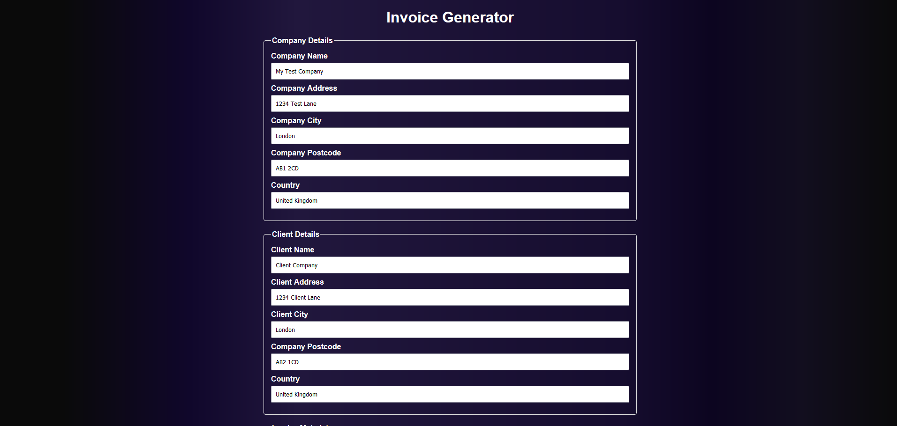
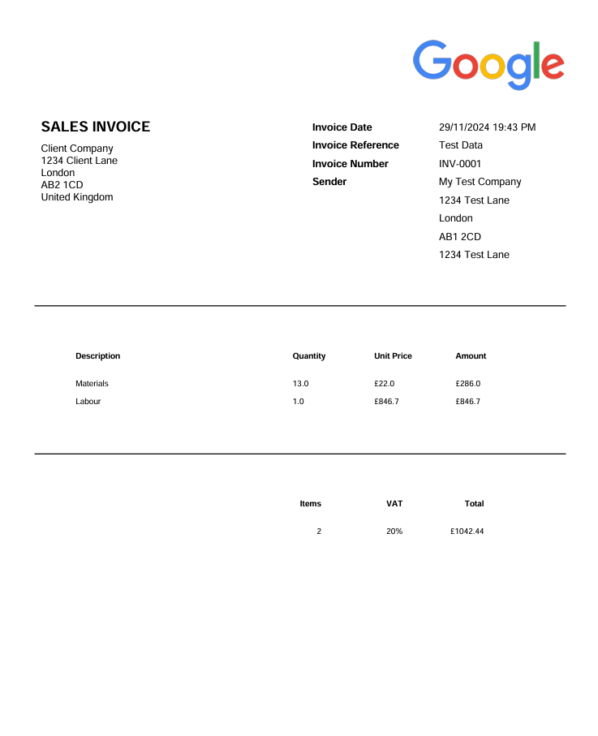

# Invoice Generator

This is a full stack application I have created using Python, HTML, CSS & JavaScript. It features a beautiful landing page, a customisation page which allows the user to enter data for the invoice, including company information, client information and invoice data. A PDF invoice is generated, downloaded, and the user is redirected back to the home page.

## Examples
### Homepage 

### Customise page

### Output 

